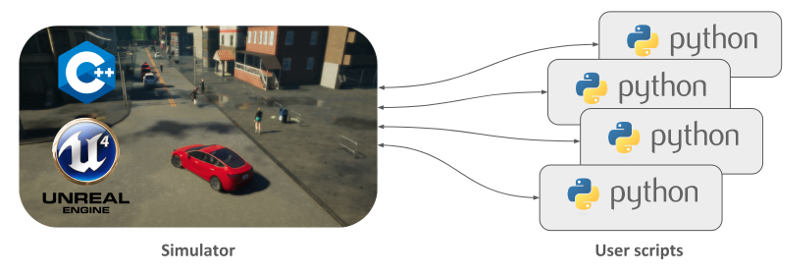
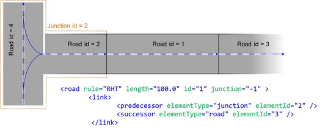
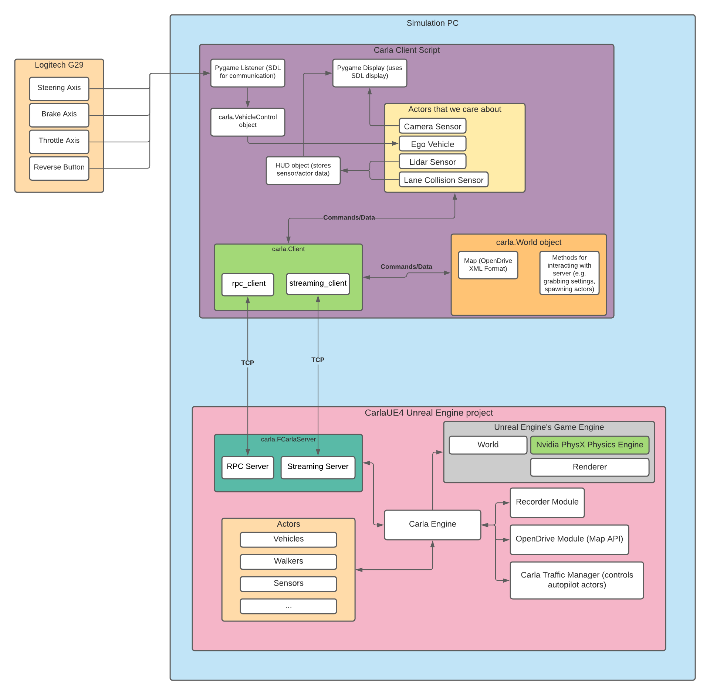
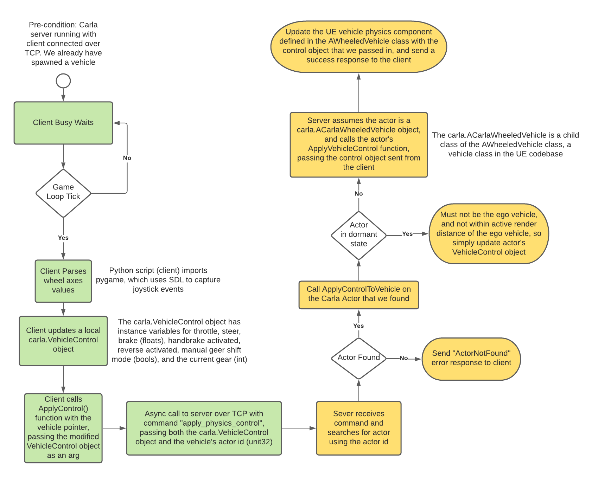
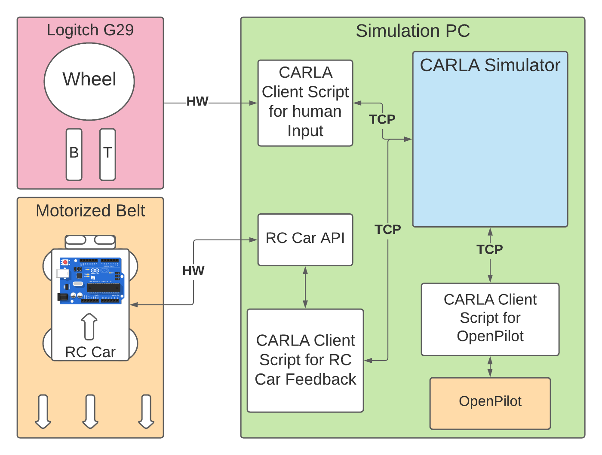

# Carla Architectural Overview

## Introduction

### Notes
Some of the information and diagrams below are from the carla docs, while others are created manually by looking into the code. The first few sections are adapted from the docs themselves, giving a high level overview of the simulator architecture.

### Client/Server Intro
Carla is mainly divided into two parts: The client and the server. The server is grounded on Unreal Engine to run the simulation and uses the [OpenDRIVE standard](https://www.asam.net/standards/detail/opendrive/) (v1.4 as today) to define roads and urban settings.

The server is responsible for everything related to the simulation itself, including:
- Computation of physics
- Updates on the world-state and its actors
- Sensor rendering

**The client** provides the ability to control both actors and world conditions, as well as receive information from the simulation. There can be multiple clients running at the same time connected to one server.

**The world** is an object representing the simulation. It is a layer containing methods to spawn actors and change states in the simulation. There is only one world per simulation.



### Common terms
Some common terms are defined below. They may have been used above loosely.

- An **actor** is anything that plays a role in the simulation *(e.g. vehicles, walkers, traffic signs, etc.)*
- **Blueprints** are actor layouts necessary to spawn an actor, consisting of models that have animations and attributes. *(e.g. There are blueprints for walkers, different vehicles, and different signs)*
- A **map** is an object that represents the simulated world. The map uses the OpenDRIVE standard, which uses XML syntax to describe the geometry of roads, lanes, and other road features.
- A **sensor** is an actor that is attached to the parent vehicle which gathers information of the surroundings. Some examples include cameras, collision detectors, and lane invasion detectors.


## Client and World
The client communicates with the server over TCP, so we can initialize it with the server IP and port. Most of the communication from the client to the server will happen through the world object, which not only has simulation information, but also acts as a convenient wrapper for server communication methods. Most of the general settings and simulation information can be accessed from the World Class.

### Client Commands
It's also possible to send **commands** to the server from the client in batches with *client.apply_batch()*, which allows a list of commands to be applied to the simulator in one single step, which can be useful if we need to run several commands in a reasonable amount of time.\
e.g. `client.apply_batch([carla.command.DestroyActor(x) for x in vehicles_list])`

### Interacting with actors
Through the world class we can do things such as spawn actors, get/find actors in the world, and access things such as the spectator actor which gives the simulation's point of view.

### Debugging in the simulator
World objects have a carla.DebugHelper object as a public attribute. This can be useful with creating debug shapes around actors and drawing other indicators such as arrows and lines.

## Blueprints and Actors

Blueprints allow the user to smoothly incorporate new actors into the simulation. We can access these blueprints with the world object: `blueprint_library = world.get_blueprint_library()`

### Attributes
Blueprints contain attributes such as vehicle color, walker speed, whether a walker is invincible, and others. Some of these attributes are modifiable while others are not. A list of the blueprints available in carla can be found [in the docs at this link](https://carla.readthedocs.io/en/latest/bp_library/)

Also, a blueprint's modifiable attributes come with a list of recommended values.
```python
for attr in blueprint:
    if attr.is_modifiable:
        blueprint.set_attribute(attr.id, random.choice(attr.recommended_values))
```

### Spawning
The world object is responsible of spawning actors and keeping track of these. Spawning only requires a blueprint, and a `carla.Transform` stating a location and rotation for the actor.The
- CARLA uses the Unreal Engine coordinates system with pitch, yaw, and roll.
```python
transform = Transform(Location(x=230, y=195, z=40), Rotation(yaw=180))
actor = world.spawn_actor(blueprint, transform)
```

### Handling
We can modify actor attributes directly after finding the actor
```python
print(actor.get_acceleration())
print(actor.get_velocity())

location = actor.get_location()
location.z += 10.0
actor.set_location(location)
```
We can also change some things that relate to the physics of the actors
```python
actor.set_simulate_physics(False) # enable or disable simulation of physics on this actor
actor.set_enable_gravity(False) # enable or disable gravity for the actor
actor.set_target_velocity(Vector3D(x=10, y=5, z=0)) # set actor's velocity vector. Applied before the physics step
```

### Spectator
The spectator actor is placed by Unreal Engine to provide an in-game point of view. We can change the in game POV with this actor.

### Vehicle
Vehicle actors are special since they incorporates special internal components that simulate the physics of wheeled vehicles.

`carla.VehicleControl` provides input for driving commands such as throttle, steering, brake, etc.
`carla.VehiclePhysicsControl` defines physical attributes of the vehicle and contains two more controllers
- `carla.GearPhysicsControl` which controls the gears.
- `carla.WheelPhysicsControl` which provides specific control over each wheel.\
```python
vehicle.apply_physics_control(carla.VehiclePhysicsControl(max_rpm = 5000.0, center_of_mass = carla.Vector3D(0.0, 0.0, 0.0), torque_curve=[[0,400],[5000,400]]))
```
Vehicles have a `carla.BoundingBox` encapsulating them. This bounding box allows physics to be applied to the vehicle and enables collisions to be detected.

### Walkers
Work similar to vehicles, control over them provided by controllers.

## Maps and navigation
Maps include both the 3D model of a town and its road definition. The road definition is based on an OpenDRIVE file
  - Note: Although the OpenDRIVE standard defines some features that have corresponding actor blueprints such as traffic signs and lights, CARLA maps do not have traffic signs nor lights in the OpenDRIVE file. These are automatically generated by the simulator using the OpenDRIVE file information or manually placed by the developer.
  - An example from the OpenDrive docs shows a simple example of how individual road segments may be connected using the standard\
  

### Waypoints (Need to check over!!)
A `carla.Waypoint` is a 3D-directed point in the CARLA world corresponding to an OpenDRIVE lane.\
The client initially retrieves the map object from the server, which searches for the OpenDrive file and returns it as a string. After this initial retrieval, all navigation happens on the client side using a combination of methods from `carla.Waypoint` and `carla.Map`
- Waypoints closer than 2cm within the same road share the same id.

## Sensors
The class `carla.Sensor` defines a special type of actor able to measure and stream data

### Setting Up
Sensors are still actors, so we can easily edit their attributes when setting them up. The following example from the docs shows modifying the attributes of a HD dashboard rgb camera sensor
```python
# Find the blueprint of the sensor.
blueprint = world.get_blueprint_library().find('sensor.camera.rgb')
# Modify the attributes of the blueprint to set image resolution and field of view.
blueprint.set_attribute('image_size_x', '1920')
blueprint.set_attribute('image_size_y', '1080')
blueprint.set_attribute('fov', '110')
# Set the time in seconds between sensor captures
blueprint.set_attribute('sensor_tick', '1.0')
```

### Spawning
Unlike normal actors, it's important to specify what the sensor will be attached to when spawning them. Location is relative to the parent actor
```python
transform = carla.Transform(carla.Location(x=0.8, z=1.7))
sensor = world.spawn_actor(blueprint, transform, attach_to=my_vehicle)
```

We can listen to sensors by passing a callback function to their `listen()` method, which is called every time the sensor retrieves data
```python
# assuming this sensor is the HD camera dashcam sensor from above, do_something() 
# will be called each time a new image is generated by the camera.
sensor.listen(lambda data: do_something(data))
```
We can also do things like save data to disk with a sensor instead of listening directly to the actor and executing a callback.

### Types of data from sensors
Sensors can return various types of data from an object that is inherited from the general `carla.SensorData` base class

<details>

  <summary>
  Example: Lane invasion event used for a <code>sensor.other.lane_invasion</code> actor
  </summary>

  ```cpp
  namespace carla {
  namespace sensor {
  namespace data {

    /// A change of lane event.
    class LaneInvasionEvent : public SensorData {
    public:

      using LaneMarking = road::element::LaneMarking;

      explicit LaneInvasionEvent(
          size_t frame,
          double timestamp,
          const rpc::Transform &sensor_transform,
          ActorId parent,
          std::vector<LaneMarking> crossed_lane_markings)
        : SensorData(frame, timestamp, sensor_transform),
          _parent(parent),
          _crossed_lane_markings(std::move(crossed_lane_markings)) {}

      /// Get "self" actor. Actor that invaded another lane.
      SharedPtr<client::Actor> GetActor() const;

      /// List of lane markings that have been crossed.
      const std::vector<LaneMarking> &GetCrossedLaneMarkings() const {
        return _crossed_lane_markings;
      }

    private:

      ActorId _parent;

      std::vector<LaneMarking> _crossed_lane_markings;
    };

  } // namespace data
  } // namespace sensor
  } // namespace carla
  ```
</details>

## Client-server synchrony
By default, CARLA runs in asynchronous mode, where the server runs the simulation as fast as possible, where the timing is independent of any client input. It is also possible to run on synchronous mode, where the server waits for a client tick, before proceeding to the next simulation step.

We can change between asynchronous and synchronous mode easily with the world object.

```python
settings = world.get_settings()
settings.synchronous_mode = True # Enables synchronous mode
world.apply_settings(settings)
```

### Physics determinism
In order to have a deterministic simulation, the client music be in perfect sync with the server (synchronous mode), and a constant time step has to be applied correctly. (can apply with `fixed_delta_seconds` world setting)


# Visuals

## Carla Architecture



## Carla Action diagram: 



## Project High Level Visualization




